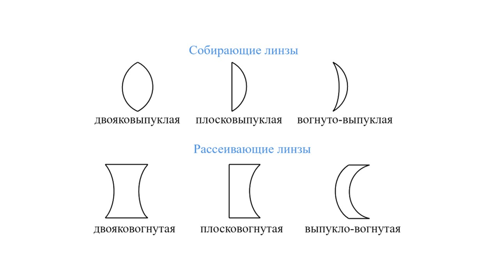
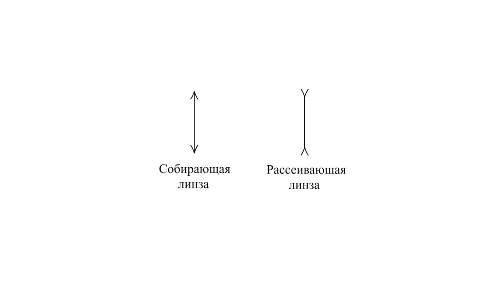

> [!info] Определение
> 
> **Линза — это оптически прозрачное однородное тело, ограниченное с двух сторон двумя сферическими (или одной сферической и одной плоской) поверхностями.**

Линза является тонкой, если толщина линзы много меньше радиусов кривизны ее сферических границ и расстояния от линзы до предмета. Линза изменяет направление светового луча из-за преломления и создает изображение.

Линзы бывают собирающими и рассеивающими. Собирающая линза в середине толще, чем у краев, а рассеивающая линза, наоборот, в средней части тоньше.

Условное обозначение тонкой собирающей и рассеивающей линзы:

Теперь давай поговорим о фокусе линзы: [[22. Фокусное расстояние линзы. Оптическая сила линзы|⏩вперед]]
