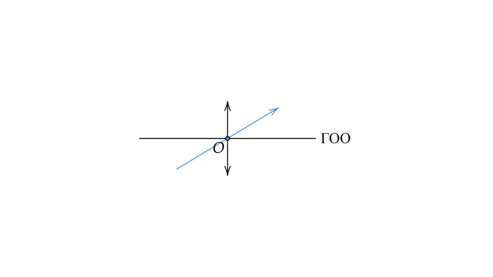
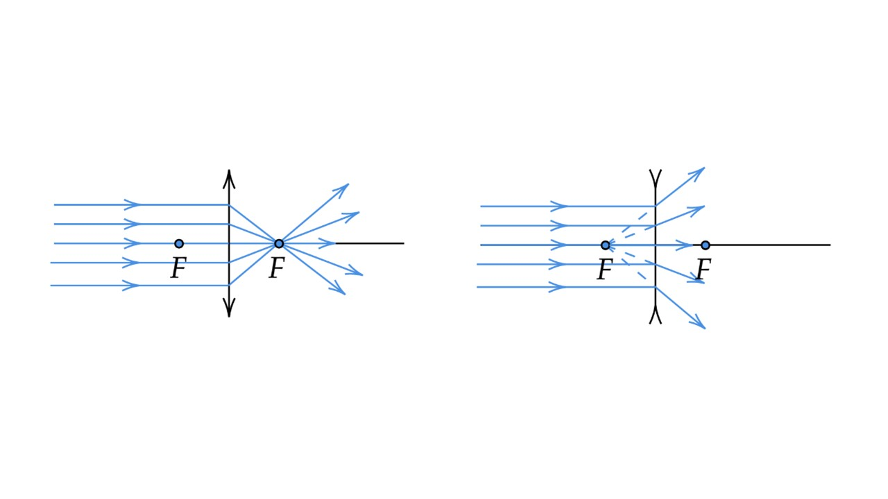
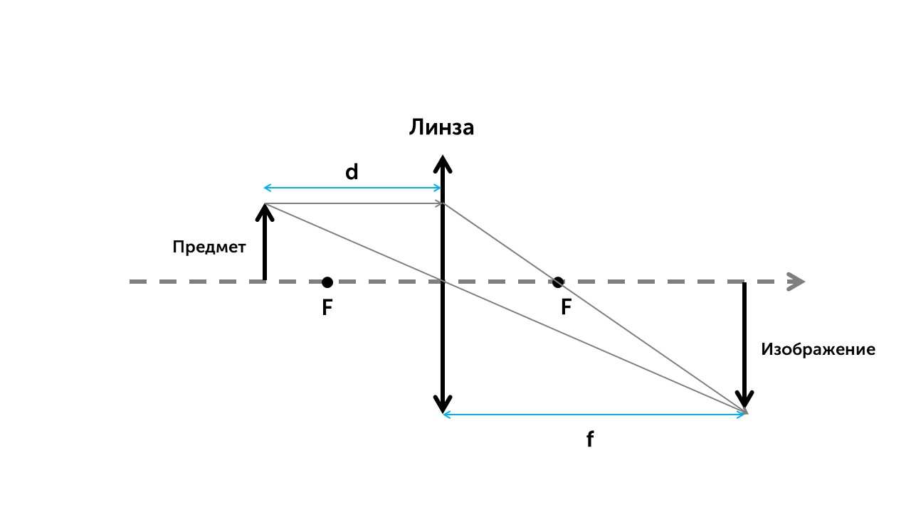
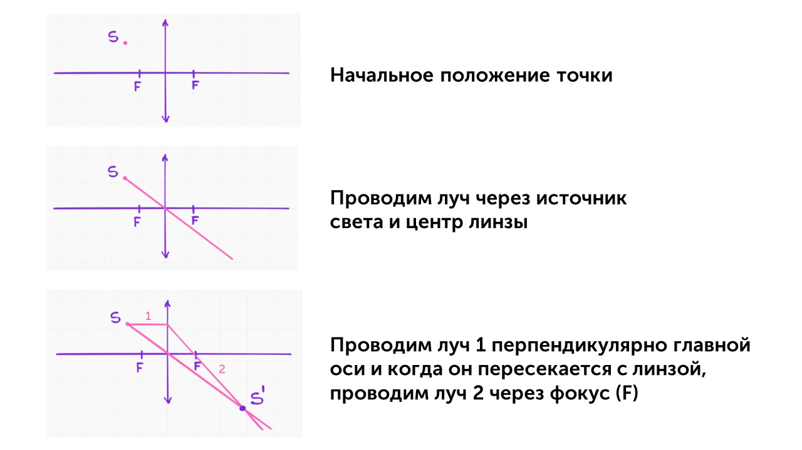
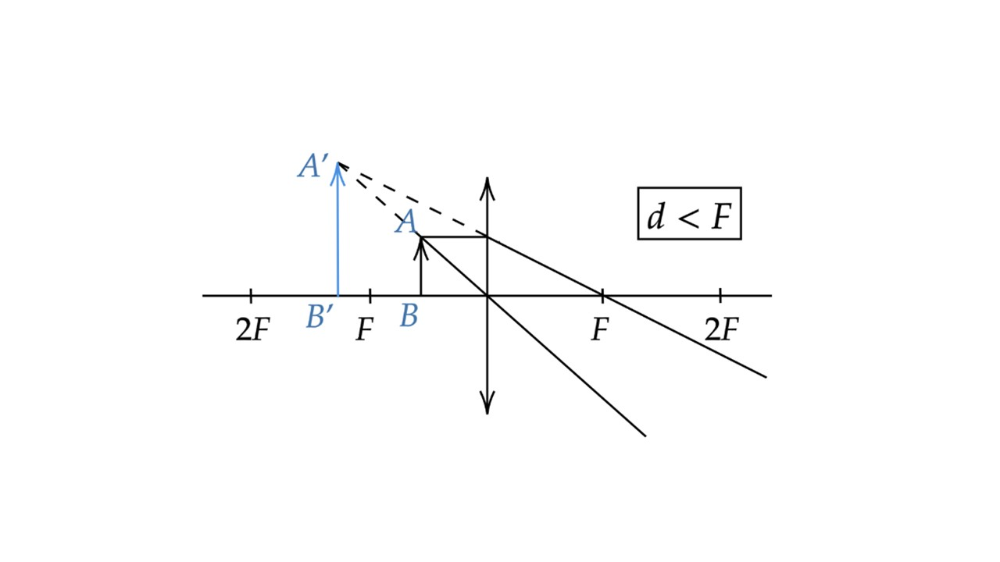
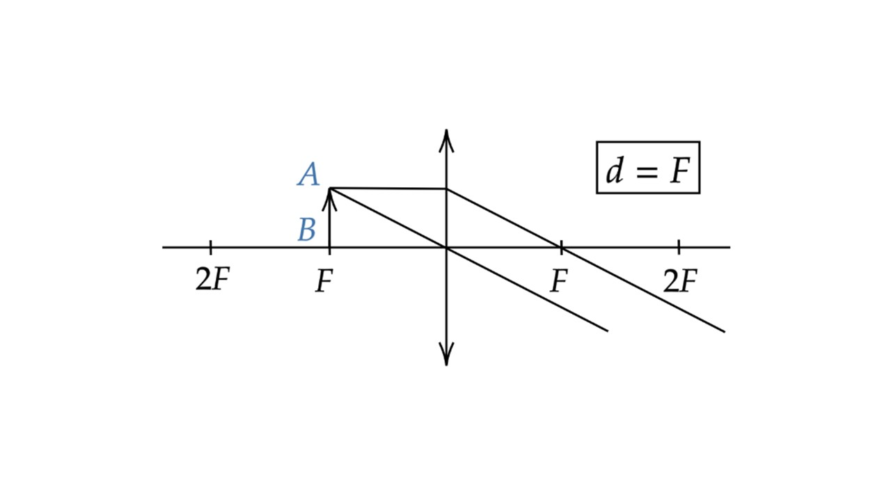
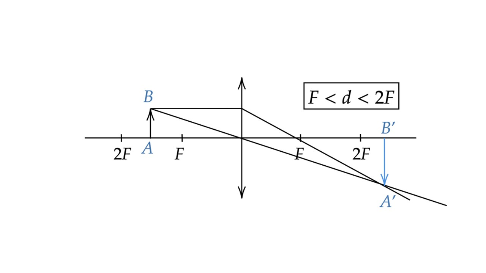
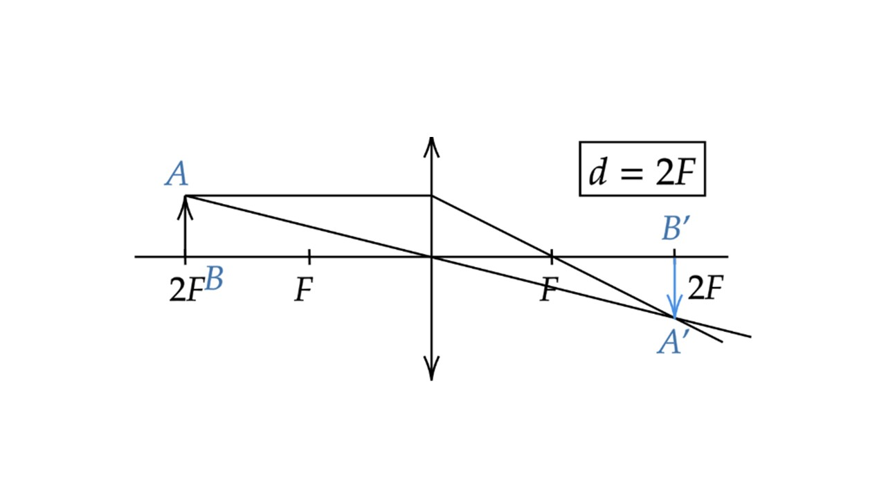
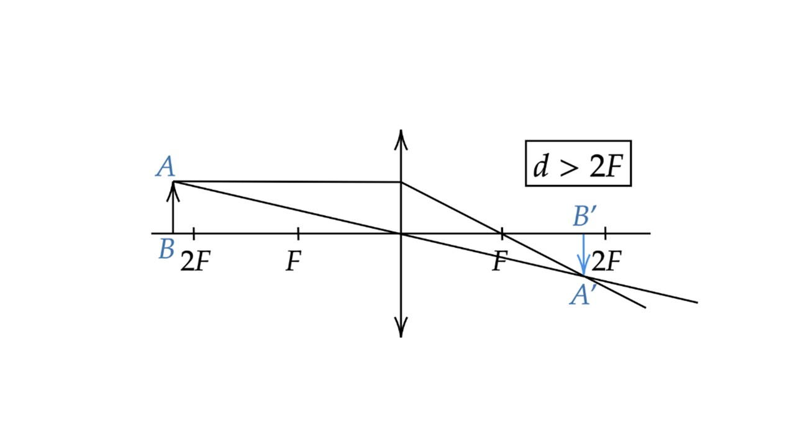

#### Главная оптическая ось

**Главная оптическая ось (ГОО)** — прямая линия, перпендикулярная линзе и пересекающая ее в одной точке, которая называется оптическим центром линзы О. Свойство оптического центра: световой луч, проходящий через оптический центр линзы, не отклоняется от своего первоначального направления, то есть не преломляется.

#### Фокус

Eсли к линзе направить пучок лучей, которые расположены параллельно главной оптической оси, то после прохождения через линзу лучи (либо их продолжения) сосредоточатся в одной точке F, которая называется главным фокусом линзы.

> [!info] Определения
> 
> **Фокусное расстояние F** - расстояние от главного фокуса до центра линзы. Единица измерения метр (м)
> 
> **Оптическая сила** - величина, обратная фокусному расстоянию F линзы:
> 
> **D = 1 / F**
> 
> Единица измерения - диоптрия (дптр)

#### Формула тонкой линзы

Взаимосвязь между, расстоянием от предмета до линзы d, фокусным расстоянием F и расстоянием от изображения до линзы f называют формулой тонкой линзы

 **$\frac{1}{F}$ =  $\frac{1}{d}$ +  $\frac{1}{d}$ = D**

#### Ход луча, прошедшего через линзу

После прохождения луча через линзу появляются изображения. Они бывают прямыми и перевернутыми, действительными и мнимыми, увеличенными и уменьшенными

Давай посмотрим на как строить такие изображения

##### Источник света

Точка S$^′$  - это изображение источника света. Таким же образом строятся изображения предметов

##### Источник света на ГОО

##### Предмет между линзой и фокусом

При стандартном построении, лучи выйдут из линзы, нигде не пересекаясь. Мы достроим их при помощи пунктирной линии и в точке А$^′$ они пересекутся. Отрезок А$^′$B$^′$
будет изображением. В данном случаем линза работает как лупа, увеличивая изображение. Кстати о нем.

**Изображение: мнимое, прямое и увеличенное**

##### Предмет на фокусе

Если предмет находится на фокусе, то изображения не будет

##### Предмет между первым и вторым фокусом

Построение стандартное

**Изображение: действительное, перевернутое, увеличенное**

##### Предмет на втором фокусе

Построение стандартное

**Изображение: действительное, перевернутое, равное по величине**

##### Предмет за вторым фокусом

Построение стандартное

**Изображение: действительное, перевернутое, уменьшенное**

Вот такими бывают линзы. Кстати, ты знал, что ты каждый день ходишь с линзами, давай расскажу об этом: [[23. Глаз как оптическая система. Оптические приборы|⏩вперед]]

