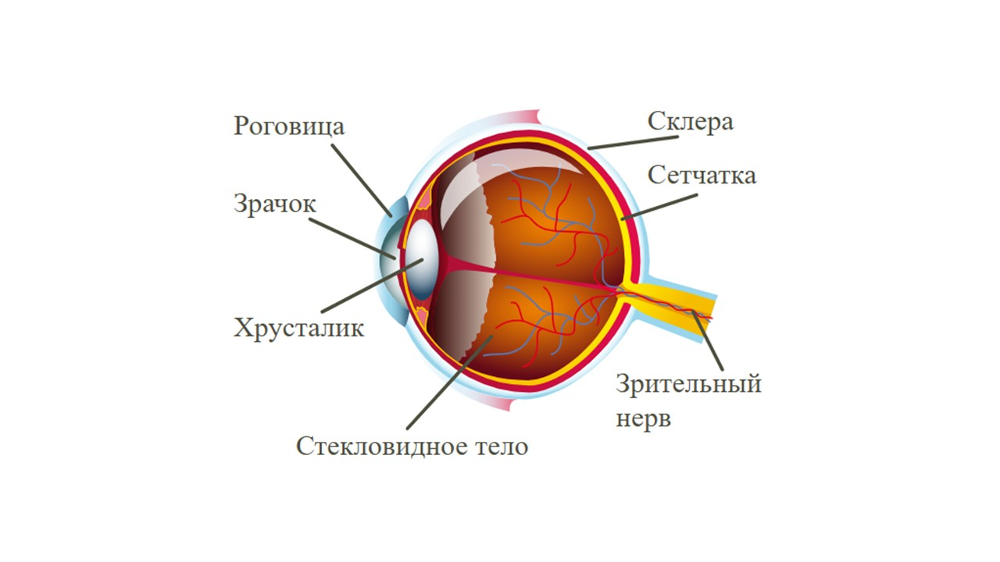

Большинство информации человек получает при помощи зрения 👀

Глаза человека с точки зрения физики сложная преломляющая оптическая система. Глаз имеет почти шарообразную форму и диаметр около 2,5 см.

Вот так выглядит глаз человека изнутри. Давай разберем некоторые его элементы:

**Роговица**. Это прозрачная внешняя оболочка, которая выполняет роль линзы и даёт основную часть преломления света

**Хрусталик**. Линза находящаяся за зрачком, она может изменять кривизну, чтобы четко видеть вблизи и вдали

**Зрачок.** Отверстие в радужке, регулирует количество света (поэтому в темноте зрачки большие - им нужно больше света, а при ярком свете они уменьшаются)

**Стекловидное тело.** Прозрачная гелеобразная среда, удерживает форму глаза

**Сетчатка.** Это экран на который проецируется изображение. Она состоит из нескольких слоев клеток. Палочки — отвечают за чёрно-белое зрение и чувствительность при слабом освещении. Колбочки — обеспечивают цветное зрение и высокую остроту изображения.

Особенность глаза - это аккомодация

> [!info] Определения
> 
> **Аккомодация — способность глаза приспосабливаться к чёткому различению предметов, расположенных на разных расстояниях от глаза. В процессе аккомодации кривизна хрусталика меняется так, что изображение предмета всегда оказывается на сетчатке.**

Благодаря этой способности можно четко видеть предметы вблизи и вдали. Главное запомнить:

Чем ближе тело к глазу, тем меньше фокусное расстояние, а чем дальше, тем больше.

Чем больше фокусное расстояние, тем меньше оптическая сила и наоборот, чем меньше фокусное расстояние, тем больше оптическая сила.

С глазками все.

Пора разобраться в квантовых явления: [[../Квантовые явления/2. Радиоактивность. Альфа-, бета-, гамма-излучения. Реакции альфа- и бета-распада|БУУУМ💥]]
