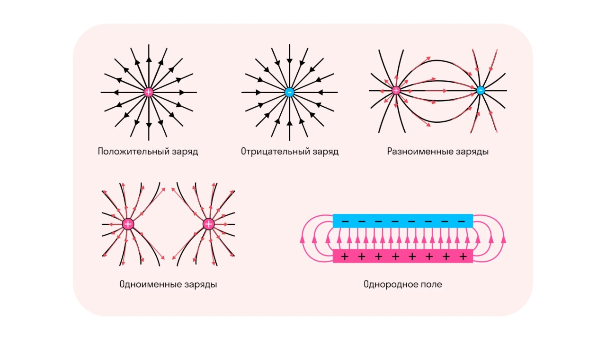
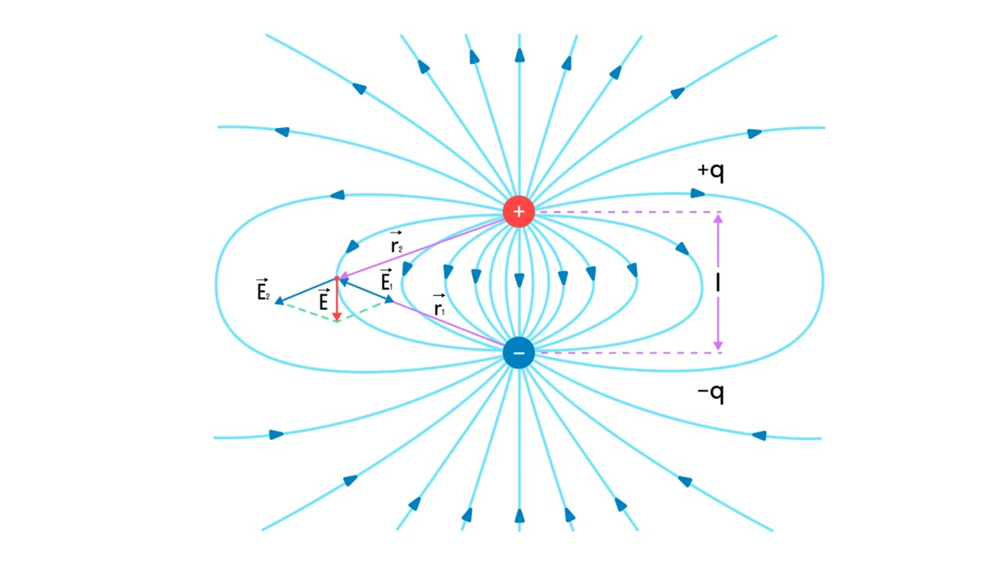

#### Электрическое поле

Они невидимы глазу, но могут заставить предметы двигаться без касания. Они находятся вокруг нас повсюду, создавая силу, даже когда мы этого не видим. Они существуют благодаря заряженным частицам и могут быть как слабыми, так и сильными. Что это? Конечно же, электрические поля! 

> [!info] Определение
> 
> **Электрическое поле — это особый вид материи, создаваемый электрическими зарядами и проявляющийся в виде силы, действующей на другие заряды в пространстве. Поле окружает любой заряд, и его можно описать вектором напряжённости, направленным от положительных зарядов к отрицательным.** 

Электрические поля можно изобразить при помощи силовых линий

#### Напряженность электрического поля

> [!info] Определение
> 
> **Напряжённость электрического поля — это физическая величина, которая показывает, с какой силой поле действует на единичный положительный заряд, помещённый в данную точку.** 

#### Принцип суперпозиции

> [!info] Определение
> 
> **Принцип суперпозиции электрических полей утверждает, что если в одной точке пространства создают поле несколько зарядов, то результирующая напряжённость в этой точке равна векторной сумме напряжённостей, создаваемых каждым зарядом по отдельности.** 

Это означает, что электрические поля от нескольких зарядов накладываются друг на друга, не изменяя своих индивидуальных характеристик. Для точек, в которых поля создаются несколькими зарядами q1,q2,…,qn результирующая напряжённость E в этой точке будет равна:

**E=E1+E2+…+En​** 

Эти темы также не встречаются на экзамене, но знать про них стоит. Давай перейдем к следующей теме: [[5. Действие электрического поля на заряды. Проводники и диэлектрики|⏩вперед]]
