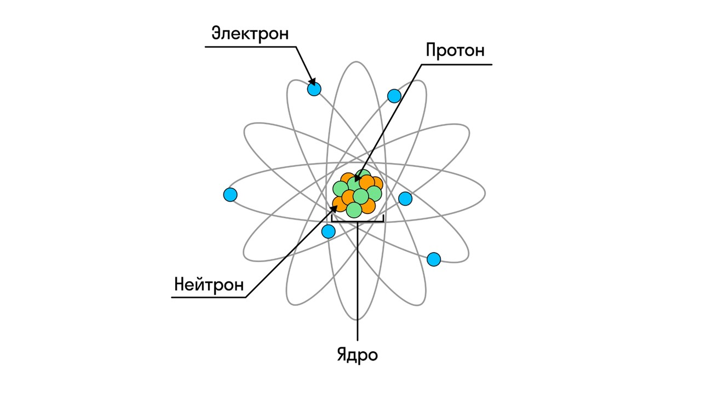
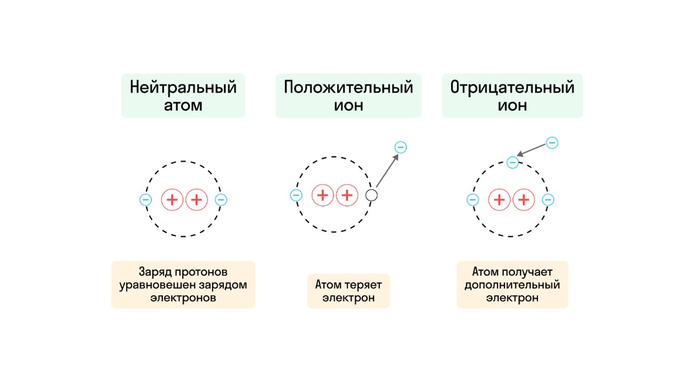
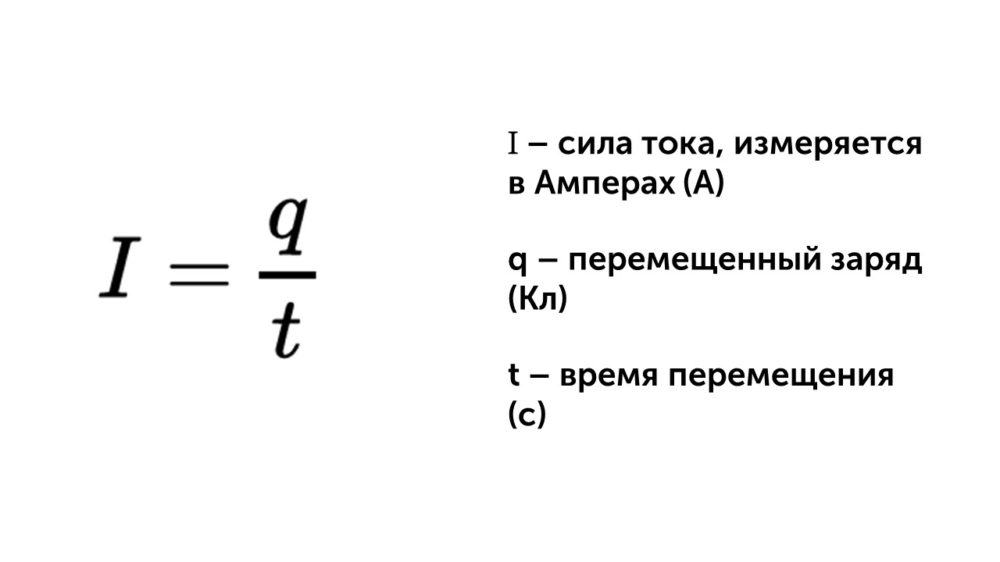
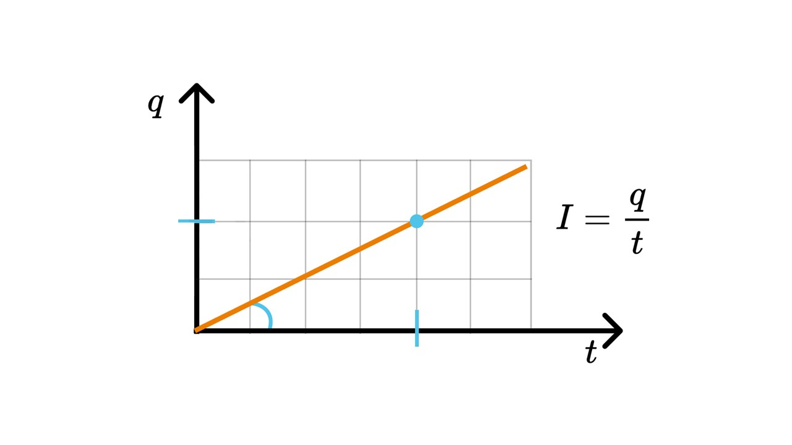
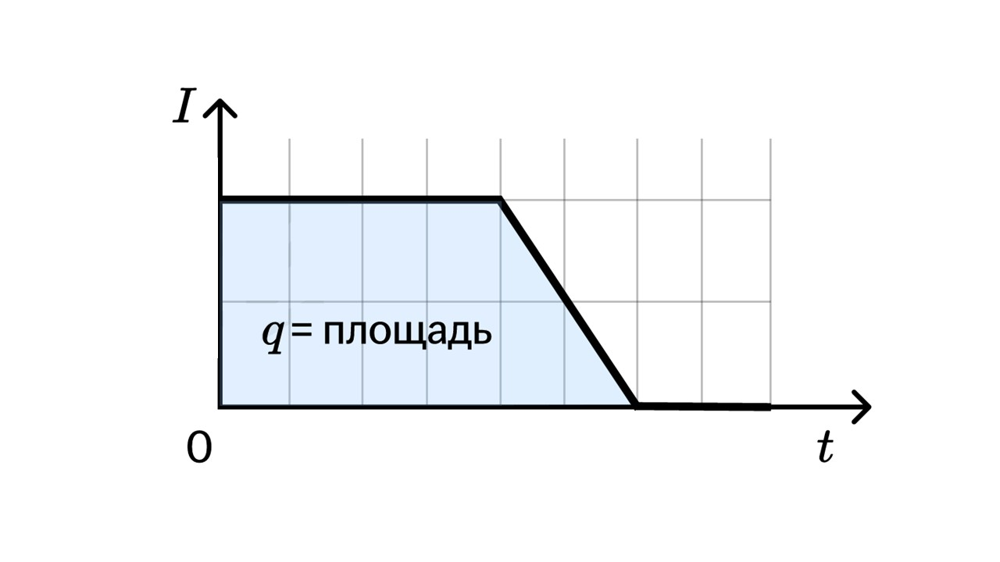
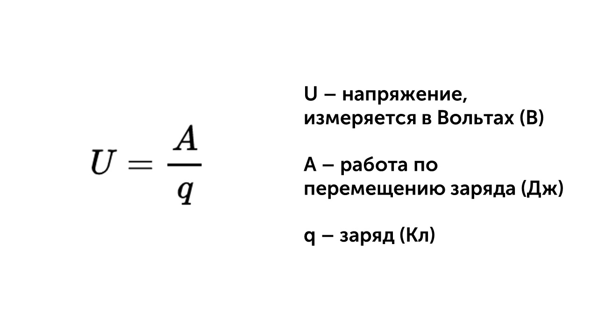
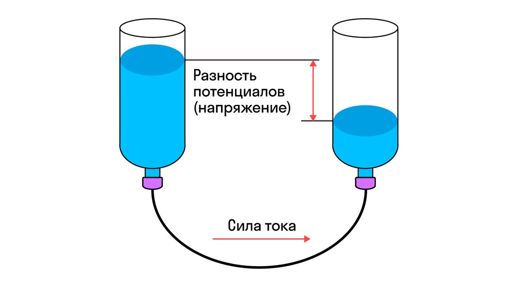
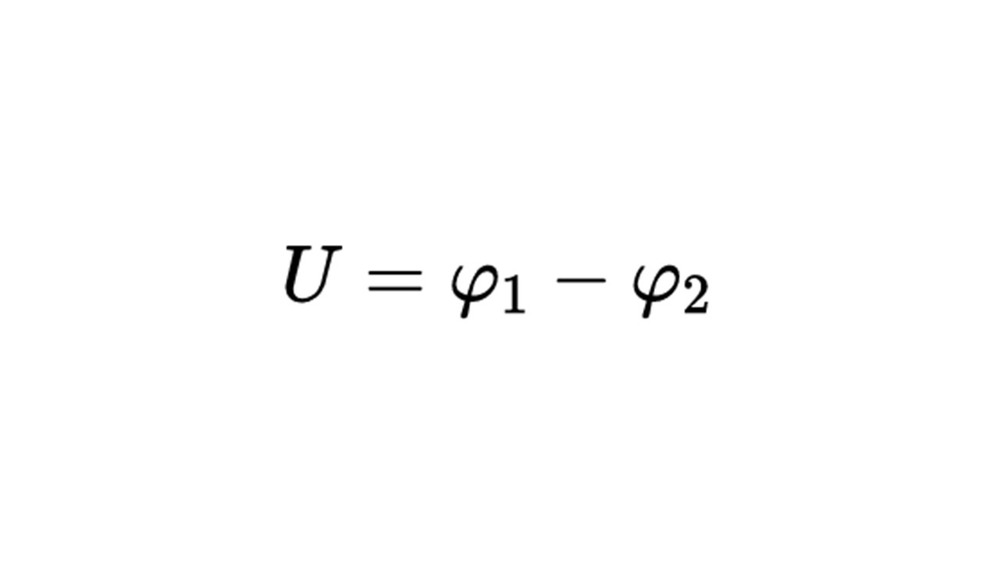

Без электрического тока невозможно представить современную жизнь - он лежит в основе большинства технологий, которыми мы пользуемся каждый день. Давай разберем с тобой что такое электрический ток с точки зрения физики и какие законы определяют его поведение. 

#### Основа законов электрического тока

Начнем изнутри. Мы знаем, что молекулы состоят из атомов, а атомы состоят из протонов, нейтронов и электронов

Каждая частица (протон, нейтрон, электрон) характеризуется зарядом.

> [!info] Определение
> 
> **Заряд (q) — это физическая величина, которая показывает степень возможного участия тела в электромагнитных взаимодействиях.** 

Заряд измеряется в Кулонах (Кл). Заряд электронов считается отрицательным, протонов — положительным, а нейтроны не обладают зарядом.

Количество электронов и протонов в атоме одинаково, поэтому положительные и отрицательные заряды как бы нейтрализуют друг друга, и атом становится электрически нейтральным. 

#### Электризация 

Во время взаимодействия тел электроны могут перемещаться между телами. Этот процесс называется электризацией, и он способен «заряжать» тела. 

**1)** Атом, который присоединил к себе чужие электроны, становится отрицательно заряженным ионом — анионом. 

**2)** Атом, который потерял свои электроны, становится положительно заряженным ионом — катионом 

#### Электрический ток⚡

> [!info] Определение
> 
> 
**Электрический ток — это направленное движение заряженных частиц.**

Сравним это с электризацией: в процессе электризации электроны перемещаются с одной поверхности на другую, разово. В электрическом токе частицы перемещаются какое-то продолжительное количество времени и делают это в одном направлении 

> [!info] Определение
> 
> **Сила тока I — это величина, показывающая, какой электрический заряд проходит через поперечное сечение проводника за единицу времени.**

Считается сила тока по такой формуле

Сила тока говорит нам, насколько интенсивно движутся заряды по проводнику, проходя через его сечение. Это можно сравнить с потоком воды в реке: чем сильнее поток, тем больше воды протекает за определенный промежуток времени. Также чем больше сила тока, тем больше зарядов проходит за одно и то же время, что влияет на мощность, которую может развить прибор. 

На графике сила тока выглядит так

Заряд можно найти как площадь под графиком силы тока от времени (по аналогии с путем на графике v(t))

#### Напряжение⚡⚡

> [!info] Определение
> 
> **Напряжение — это работа, которую совершает электрическое поле по перемещению единичного заряда между двумя точками.**

Напряжение можно представить как своеобразную «силу», которая заставляет заряды двигаться по проводнику, создавая ток. Считается по формуле 

 Если представить напряжение, то оно похоже на разницу уровней воды в двух соединенных сосудах: вода будет течь из места с высоким уровнем в место с низким. Подобным образом электрические заряды движутся от точки с более высоким потенциалом к точке с более низким потенциалом. 

> [!info] Определение
> 
> **Электрический потенциал (φ) — это энергетическая характеристика точки электрического поля, которая показывает, какую работу нужно совершить, чтобы переместить единичный положительный заряд из бесконечности в данную точку.**

 Напряжение можно посчитать при помощи разницы потенциалов

**φ1** – потенциал поля в точке 1 (начальная точка) (В)

**φ2** – потенциал поля в точке 2 (конечная точка) (В)

Теперь давай узнаем что такое сопротивление: [[7. Электрическое сопротивление|⏩вперед]]
