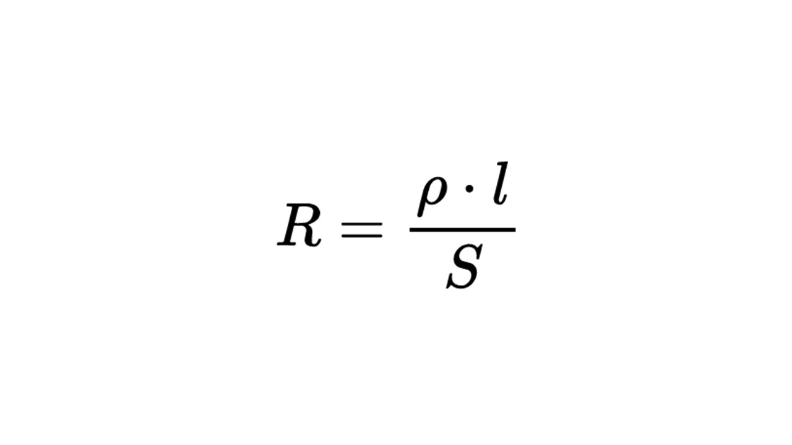

> [!info] Определение
> 
>**Электрическое сопротивление R — это характеристика, не тока, а проводника, которая показывает, насколько он «сопротивляется» движению электрического тока.**

Представьте себе шоссе: если дорога узкая или с ямами, машине будет сложнее по ней двигаться. Так и в проводнике: чем выше его сопротивление, тем труднее зарядам двигаться по нему.

Разные материалы имеют разные сопротивления: медь или алюминий обладают низким сопротивлением, а резина — высоким. Кроме того, сопротивление проводника может изменяться с температурой. Например, у металлов оно возрастает при нагревании, а у некоторых полупроводников — снижается. 

Считается по сопротивление по формуле

**R** - сопротивление, измеряется в Омах (Ом)

**ρ** — удельное сопротивление проводника (Ом * мм$^2$ / м)

***l*** - длина проводника (м)

**S** - площадь поперечного сечения проводника (мм$^2$)

Сопротивление зависит только от характеристик проводника, и не зависит от напряжения или силы тока. 

Теперь давай поговорим о самом важно законе электричества: [[8. Закон Ома для участка электрической цепи|⏩вперед]]

