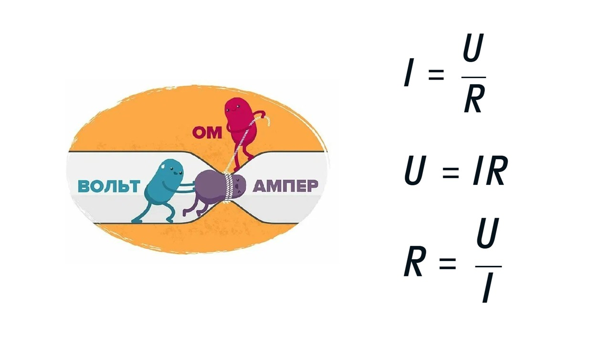
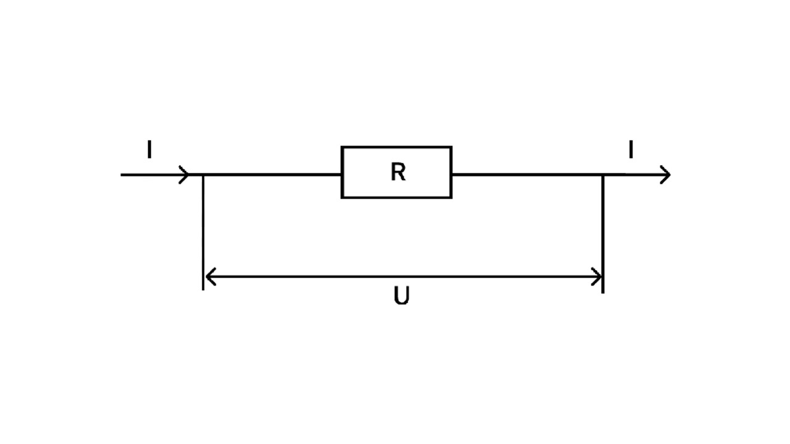
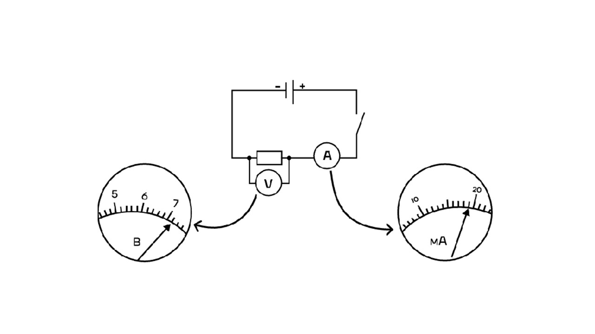
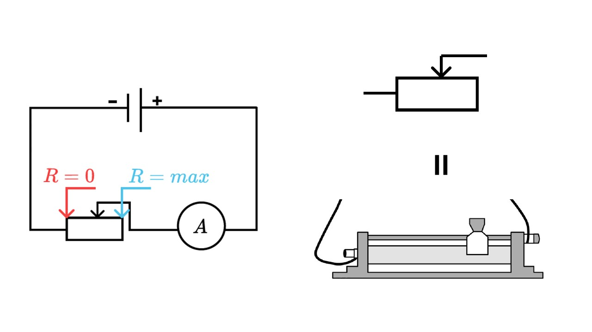
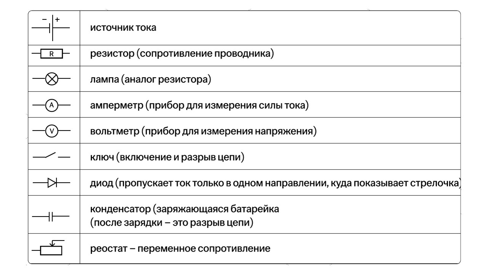

Закон Ома звучит так

> [!info] Закон Ома
> 
> **Сила тока на участке цепи прямо пропорциональна приложенного к нему напряжения и обратно пропорциональна сопротивлению этого участка** 

Формулы закона Ома выглядят так

Участок цепи – часть электрической цепи БЕЗ источника тока.

#### Амперметр, вольтметр

Это приборы для измерения силы тока и напряжения

Подключение измерительных приборов в электрическую цепь 

Идеальный амперметр имеет нулевое сопротивление и всегда подключается в цепь последовательно. 
 

При параллельном подключении его можно считать проводом 

Идеальный вольтметр имеет бесконечное сопротивление и всегда подключается в цепь параллельно. 
 

При последовательном подключении в ветви с вольтметром тока не будет.

#### Реостат

**Реостат** – это прибор для изменения сопротивления

**Смотрим на стрелочку:**


Если она двигается влево, то сопротивление уменьшается до нуля в крайнем положении, так как ток идет в обход реостата.
 

Если вправо – то сопротивление увеличивается и в крайнем положении току нужно пройти весь реостат

#### Элементы в электрических цепях

Ниже на рисунке показаны основные приборы и элементы в электрических цепях

Теперь давай перейдем к типу соединения проводников: [[9. Последовательное и параллельное соединения проводников|⏩вперед]]
