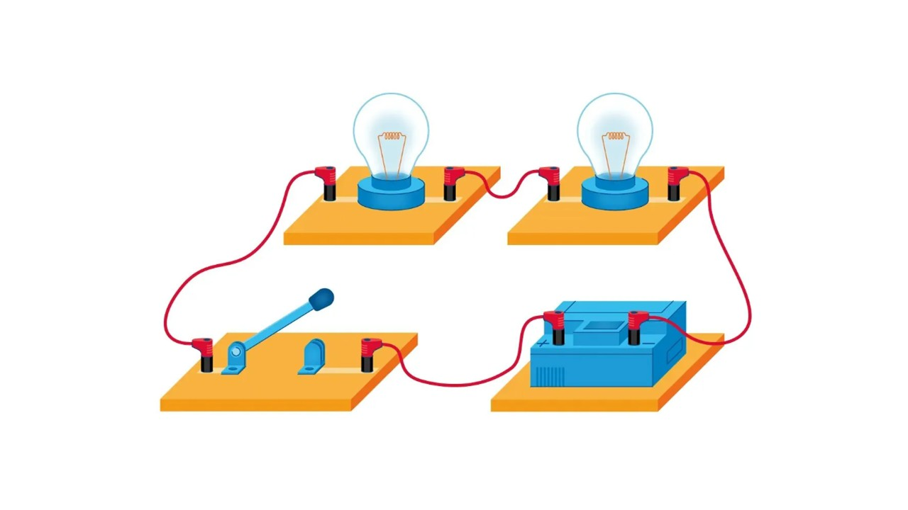
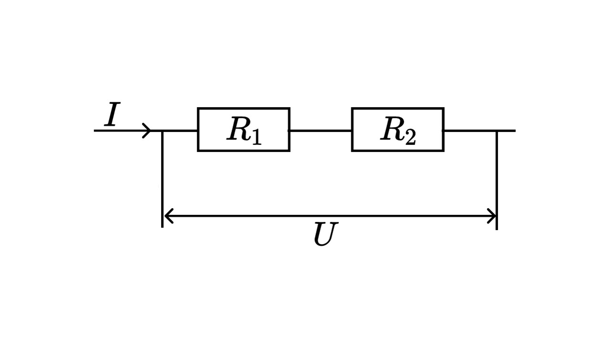

Последовательное и параллельное соединение проводников: При последовательном - проводники соединены друг за другом (конец одного с началом другого). При параллельном - начала всех проводников соединены в одной точке, а концы - в другой. 

#### Последовательное соединение

При последовательном соединении конец первого проводника соединяют с началом второго, конец второго — с началом третьего и т. д.

 

Последовательное подключение обычно используется в тех случаях, когда необходимо целенаправленно включать или выключать определенный электроприбор. Например, для работы школьного электрического звонка требуется соединить его последовательно с источником тока и ключом. 

**Законы последовательного соединения проводников** 

 
  
**1) При последовательном соединении сила тока в любых частях цепи одна и та же:** 

I = I1 = I2 = … = In 

**2) При последовательном соединении общее сопротивление цепи равно сумме сопротивлений отдельных проводников:** 

R = R1 + R2 + … + Rn

**3) При последовательном соединении общее напряжение цепи равно сумме напряжений на отдельных участках:** 

U = U1 + U2 + … + Un

#### Параллельное соединение

