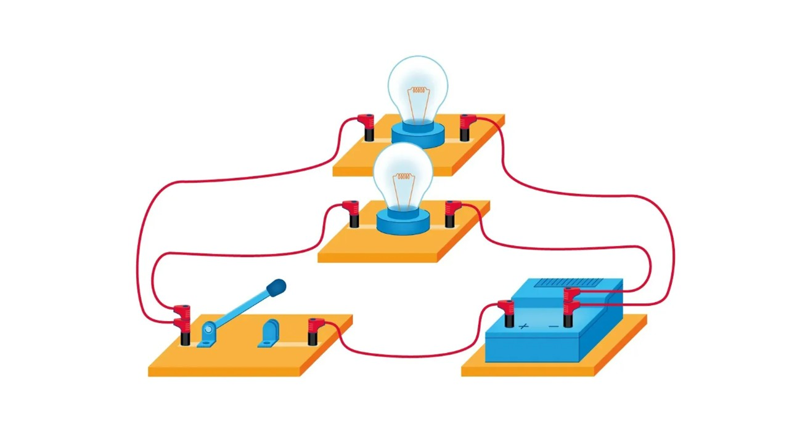
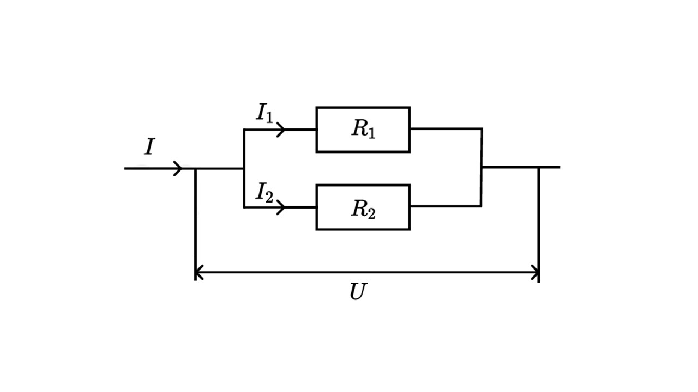
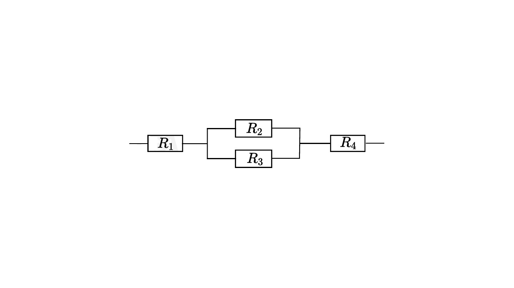
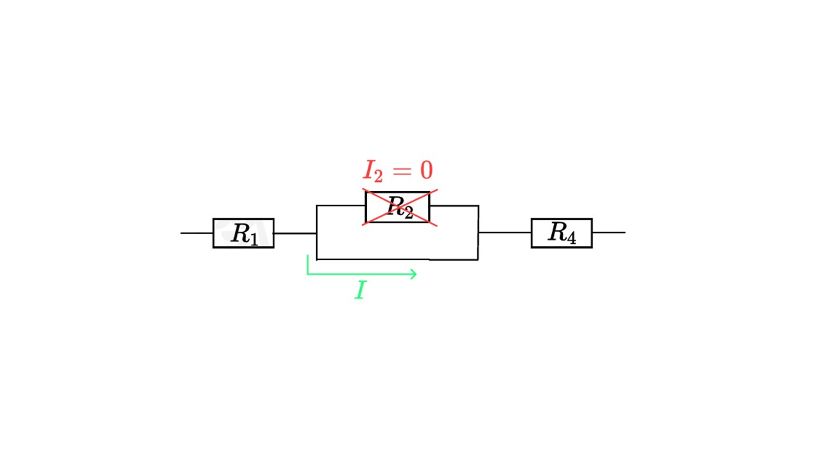

Последовательное и параллельное соединение проводников: При последовательном - проводники соединены друг за другом (конец одного с началом другого). При параллельном - начала всех проводников соединены в одной точке, а концы - в другой. 

#### Последовательное соединение

При последовательном соединении конец первого проводника соединяют с началом второго, конец второго — с началом третьего и т. д.

 

Последовательное подключение обычно используется в тех случаях, когда необходимо целенаправленно включать или выключать определенный электроприбор. Например, для работы школьного электрического звонка требуется соединить его последовательно с источником тока и ключом. 

**Законы последовательного соединения проводников** 

 
  
**1) При последовательном соединении сила тока в любых частях цепи одна и та же:** 

I = I1 = I2 = … = In 

**2) При последовательном соединении общее сопротивление цепи равно сумме сопротивлений отдельных проводников:** 

R = R1 + R2 + … + Rn

**3) При последовательном соединении общее напряжение цепи равно сумме напряжений на отдельных участках:** 

U = U1 + U2 + … + Un

#### Параллельное соединение

При параллельном соединении начала всех проводников соединяются в одной общей точке электрической цепи, а их концы — в другой. 

Параллельное соединение используют в тех случаях, когда необходимо подключать электроприборы независимо друг от друга. Например, если отключить чайник, то холодильник будет продолжать работать. А когда в люстре перегорает одна лампочка, остальные все так же освещают комнату. 

**Законы параллельного соединения проводников** 

**1) Напряжение при параллельном соединении в любых частях цепи одинаково:**

U = U1 = U2 = … = Un

Как вы помните, все бытовые электроприборы рассчитаны на одинаковое номинальное напряжение 220 В. Да и согласитесь, куда проще делать все розетки одинаковыми, а не рассчитывать напряжение для каждого прибора при их последовательном соединении. 

**2) Сила тока при параллельном соединении (в неразветвленной части цепи) равна сумме сил тока в отдельных параллельно соединенных проводниках:**

I = I1 + I2 + … + In 

**3) Общее сопротивление цепи определяется по формуле:**

1 / R = 1 / R1 + 1 / R2 + … + 1 / Rn 

#### Комбинированное соединение

Комбинированным называется соединение, при котором некоторые проводники соединены последовательно, а некоторые — параллельно.

> [!warning] Важно
> 
> **Если есть путь по проводу – это нулевое сопротивление.**
> 
 >**Ток всегда старается протекать по нулевому сопротивлению. Если в предыдущей схеме резистор R3 заменить на пустой провод, то при разветвлении цепи весь ток пойдет только через пустой провод, так как его сопротивление равно 0.**

Соединения  разобрали, теперь посмотрим на работу и мощность тока: [[10. Работа и мощность электрического тока|⏩вперед]]
